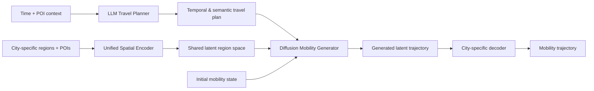

<div align="center">

# UniMob
### All Cities are Equal: A Unified Human Mobility Generation Model Enabled by LLMs

[](https://arxiv.org/abs/2602.19694)
[](https://arxiv.org/pdf/2602.19694)
[](https://arxiv.org/abs/2602.19694)

**Bo Liu · Tong Li · Zhu Xiao · Ruihui Li · Geyong Min · Zhuo Tang · Kenli Li**

</div>

---

## Overview

**UniMob** is a unified human mobility generation framework designed to generalize across cities with heterogeneous spatial structures and different levels of data availability. Rather than training an isolated mobility generator for every city, UniMob learns transferable semantic and spatial representations and combines them with diffusion-based trajectory generation.

<p align="center">
  
</p>

<p align="center"><em>Overall architecture of UniMob.</em></p>

## Abstract

Synthetic human mobility generation provides an effective and privacy-conscious way to support the data requirements of intelligent urban systems. However, most existing approaches perform well mainly in data-rich cities and often degrade substantially when transferred to cities with limited mobility data. This creates an important imbalance: the quality of generated mobility data should not depend on the size or data resources of a city. To address this problem, we propose **UniMob**, a unified human mobility generation framework that supports cross-city modeling. UniMob contains three major components. First, an **LLM-powered travel planner** derives high-level travel intentions that are both temporally aware and semantically meaningful. Second, a **unified spatial embedding module** maps heterogeneous regions from different cities into a shared representation space, reducing the mismatch caused by city-specific spatial structures. Third, a **diffusion-based mobility generator** models the joint spatiotemporal characteristics of human movement under the guidance of the generated travel plans. We evaluate UniMob on two real-world datasets covering five cities. Extensive experiments show that UniMob substantially outperforms state-of-the-art baselines, with improvements of more than **30% across multiple evaluation metrics**. Further analyses demonstrate strong performance in zero-shot and few-shot settings, verify the importance of LLM guidance, examine privacy properties, and show the usefulness of generated mobility data for downstream applications.

## Research Motivation

Cross-city mobility generation is challenging because urban regions are not naturally aligned across cities, mobility data availability is highly imbalanced, and the same region identifier may correspond to completely different semantics in another city. UniMob therefore separates **semantic travel intention**, **city-independent spatial representation**, and **trajectory generation**, enabling knowledge learned in one city to be reused in another.



## Method

### 1. LLM-Based Travel Planner

The travel planner converts contextual information into higher-level mobility intentions. Instead of asking the generator to infer all semantics directly from numerical trajectories, the LLM provides interpretable temporal and semantic guidance such as likely activity type and travel timing.

Relevant code:
- `model/model_LLM.py`
- `run/pretrain/LLM/train_travel_planner.ipynb`

### 2. Unified Spatial Embedding

Different cities have different numbers of regions and different spatial organizations. UniMob uses a spatiotemporal encoder to project city-specific regions into a shared latent space. A lightweight projector/decoder maps between this common representation and city-specific outputs.

Relevant code:
- `model/model_Encoder.py`
- `model/model_Projector.py`
- `run/pretrain/Encoder/`
- `run/tuning/tune_unified_spatial_embedding.ipynb`

### 3. Diffusion-Based Mobility Generator

A conditional diffusion model generates realistic and diverse mobility sequences in the unified space. The generator is conditioned on travel plans and initial states, and a city-specific decoder maps latent outputs back to the target city.

Relevant code:
- `model/diffusion.py`
- `model/dit.py`
- `run/pretrain/Diffusion/train_mobility_generator.py`

## Code-to-Paper Map

| Component | Main files | Role |
| --- | --- | --- |
| Travel planner | `model/model_LLM.py` | Semantic and temporal mobility guidance |
| Spatial encoder | `model/model_Encoder.py` | Unified cross-city region representation |
| Projector / decoder | `model/model_Projector.py` | City-specific adaptation |
| Diffusion backbone | `model/diffusion.py`, `model/dit.py` | Mobility sequence generation |
| Dataset pipeline | `dataset/` | Alignment, masking, city mixing, and DiT datasets |
| Pretraining | `run/pretrain/` | LLM, encoder, and diffusion pretraining |
| Target-city tuning | `run/tuning/` | Few-shot target-city adaptation |
| Evaluation | `run/test.py` | Testing and metric computation |

## Datasets

The experiments use real-world mobility data covering multiple cities and mobility modalities. The repository includes example files and preprocessing code, while full datasets should be obtained from their original providers.

| Data source | Mobility type | Role in UniMob |
| --- | --- | --- |
| CoPB / private-car data | GPS / regional trajectory | Cross-city private-car mobility generation |
| Rutgers mobility data | GPS / cell-tower localization | Cross-city generalization |
| Telecom mobility data | Telecom / POI-associated mobility | Semantic and spatial transfer |

Example repository data include `data/poi/Guangzhou_poi.csv`, `data/trip/Guangzhou_data_K48_ETS.json`, and the geographic partition in `data/grid/voronoi_clipped.geojson`.

Please follow each original dataset provider's licensing and privacy requirements.

## Training Pipeline

### Step 1 — Train the LLM Travel Planner

```text
run/pretrain/LLM/train_travel_planner.ipynb
```

### Step 2 — Pre-train the Unified Spatial Encoder

```text
run/pretrain/Encoder/train_Encoder.ipynb
run/pretrain/Encoder/test_Encoder.ipynb
```

### Step 3 — Train the Diffusion Mobility Generator

```bash
python run/pretrain/Diffusion/train_mobility_generator.py
```

### Step 4 — Adapt to a Target City

```text
run/tuning/tune_unified_spatial_embedding.ipynb
```

### Step 5 — Evaluate

```bash
python run/test.py
```

Local paths, checkpoints, and dataset locations may need to be adjusted in `args.py` or the corresponding notebooks.

## Repository Structure

```text
UniMob/
├── data/                    # Example POI, trip, and spatial-partition data
├── dataset/                 # Dataset construction and alignment
├── model/                   # LLM, encoder, projector, DiT, diffusion
├── run/
│   ├── pretrain/
│   │   ├── LLM/             # Travel planner training
│   │   ├── Encoder/         # Spatial encoder pretraining
│   │   └── Diffusion/       # Diffusion generator training
│   ├── tuning/              # Target-city adaptation
│   └── test.py              # Evaluation
├── trainer/                 # Training utilities
├── args.py                  # Main arguments
├── util.py                  # Shared utilities
├── framework.png            # Paper framework
└── README.md
```

## Paper & Download

- **arXiv:** https://arxiv.org/abs/2602.19694
- **PDF:** https://arxiv.org/pdf/2602.19694
- **Source:** https://arxiv.org/src/2602.19694
- **Current status:** Under review / revision; please refer to the latest public paper record for status updates.

## Citation

```bibtex
@article{liu2026unimob,
  title   = {All Cities are Equal: A Unified Human Mobility Generation Model Enabled by LLMs},
  author  = {Liu, Bo and Li, Tong and Xiao, Zhu and Li, Ruihui and Min, Geyong and Tang, Zhuo and Li, Kenli},
  journal = {arXiv preprint arXiv:2602.19694},
  year    = {2026}
}
```

## About the Author

This repository is maintained by **Bo Liu**, a Master’s student at the **College of Computer Science and Electronic Engineering, Hunan University** and the **National Supercomputing Center in Changsha**. His broader research focuses on **Agentic AI, LLMs, Spatiotemporal Intelligence, and Mobile Data Mining**.

For questions or collaboration, please open an issue or contact `liubo317@hnu.edu.cn`.  
Personal homepage: https://boliupro.github.io
